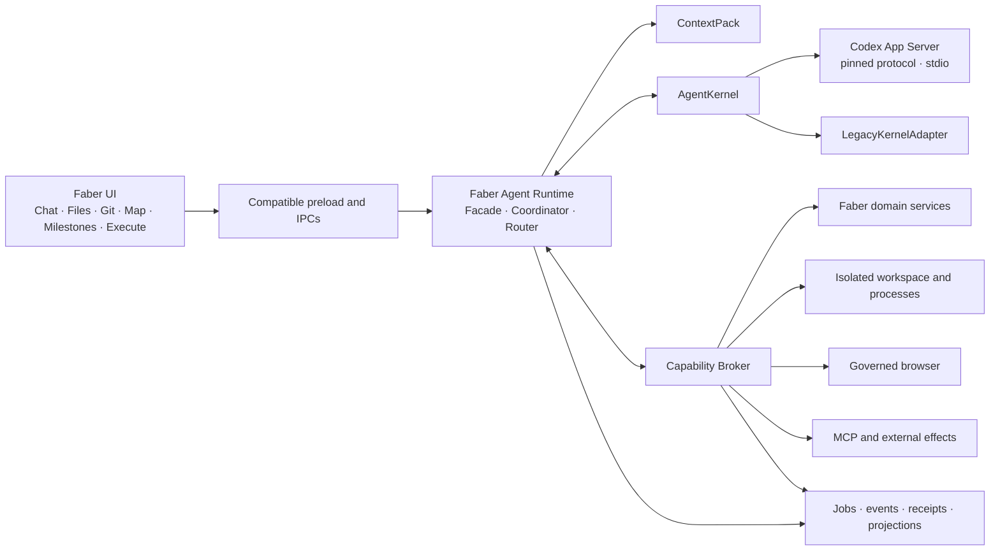

# Faber Code — Harness v2 Technical Release

**Official website:** [www.fabercode.site](https://www.fabercode.site/)

**Consolidation date:** September 9, 2026

**Public release date:** September 16, 2026

**Status:** Faber Code v0.2.0 public release; refactoring scope completed and qualified

**Release branch:** `main`

**Package version:** `0.2.0`

**Functional baseline:** `8b5e467` — guided tutorial and welcome experience

**Consolidated milestone:** `e8a3d5d` — complete governed runtime

> This document records the completion of the refactoring scope from the
> tutorial through Harness v2. “100%” means that phases 0–9 and their defined
> gates were implemented and validated; it does not mean an absolute absence
> of bugs, nor does it replace the publication, packaging, signing, tagging,
> and push checklist.

## Executive summary

This cycle preserved Faber Code as a product while progressively replacing its
orchestration core. Cortex, Files, Git, Application Map, milestones, Map Chat,
and Execute remain Faber Code surfaces. Behind them, the previous Harness gave
way to a governed agent runtime capable of planning, editing, running,
inspecting, repairing, and validating with bounded authority, isolation,
effect-based approvals, and durable evidence.

The work began with the completion of the guided tutorial and welcome landing
page. The existing contracts were then frozen, and the migration was conducted
through TDD, with a legacy adapter, shadow mode, transactional canary,
ContextPack, isolated processes, a governed browser, MCP, real application
creation, and default-on gates.

The result is a Harness with greater freedom within verifiable technical
boundaries: fewer stack-specific deterministic rules, greater capacity for
real iteration, and no silent expansion of authority.

## Milestone status

| Indicator | Status |
| --- | --- |
| Scope of this refactoring | 100% |
| Harness v2 core | 100% |
| Planned phases 0–9 | 100% |
| Phase 9 offline gates | 100% |
| Directed live smoke test | Passed |
| Technical health at close | Green |
| Public release | v0.2.0 on GitHub |

The history from the tutorial's completion through the consolidated milestone
comprises 90 linear commits with no merges. After the baseline, there were 89
additional commits and 484 files touched. During this period, the `tests/`
tree grew from 142 to 339 files. The line count is inflated by three versions
of schemas generated from the Codex App Server protocol; quality was therefore
measured by contracts, tests, receipts, and observable results, not by the
amount of code.

## 1. Guided tutorial and welcome experience

### Onboarding journey

The tutorial now covers the complete product flow:

- Steps 1–7: introduction to panels, archived projects, trash, Cortex,
  settings, and APIs, without persisting the fictitious key used in the
  demonstration.
- Steps 8–10: briefing, Design System, references, rules, documentation,
  Application Map, and persistence of five milestones.
- Steps 11–13: persisted development conversation, progressive file writes,
  Git review, three guided commit batches, local execution, and preview.
- Tutorial simulations do not consume provider credits.
- The supplied name personalizes the welcome project and is the only required
  input in the journey.
- The **Next** button remains a navigation control. Checklists and automatic
  progression guide the user without creating artificial blockers.
- The spotlight, guided cursor, and cards reposition themselves according to
  context and do not become trapped beneath modals or panels.
- The experience and generator are protected across Portuguese, English, and
  Spanish.

### Welcome project

The generated landing page received:

- Faber Code's dark visual identity, a technical grid, and orbital motion;
- a responsive trajectory following a single curve into the core;
- orbital cards rendered through a portal, with flipping and viewport bounds;
- removal of residual lines and elements;
- incremental feedback for connections and completion;
- horizontal overflow containment;
- validation on desktop, tablet, and mobile;
- a single generation source for new projects, rather than fixes applied only
  to the prototype.

The preview continues to open in the user's default browser. Electron hosts
Faber Code; it did not start opening a second Electron window for the site.

## 2. Refactoring principle

The goal was neither to rewrite the panels nor to hand the product's sources of
truth over to the AI kernel. The investment was focused on the runtime, the
capability broker, isolation, context, and event projections.

### Preserved surfaces

| Surface | Preserved contract | Internal evolution |
| --- | --- | --- |
| Cortex | memory, topics, RAG/MemPalace, and provenance | governed ContextPack source; durable promotion remains explicit |
| Files | tree, read, edit, rename, and refresh | root authority, revision, receipts, and transactional writes |
| Git | status, diff, stage, unstage, commit, and rollback | same sources of truth, with no automatic commit |
| Application Map | canvas, autosave, assets, and export | revision, digest, structured patches, and compare-and-swap |
| Milestones | milestones, tasks, states, validations, and commits | definition of done tied to evidence |
| Map Chat | history, images, analysis, and rendering | read-only session and revisioned proposals |
| Execute | execution of the AI action and project preview | governed job, streaming, cancellation, validation, and promotion |

### Resulting architecture

The canonical sources remain separate:

- code in the project's real filesystem;
- history and diffs in `.git`;
- map in `.faber/application-map.json`;
- milestones in `.faber/milestones.json`;
- map and milestone documents as regenerable projections;
- durable memory in Cortex/RAG/MemPalace, with provenance;
- visible conversation in the Faber store;
- kernel thread linked to the conversation without taking ownership of the
  domain;
- state and progress as a durable projection of the job.

## 3. Delivered phases

| Phase | Consolidated delivery |
| --- | --- |
| 0 — Baseline | public contracts, IPCs, stores, flows, and regression tests frozen before replacing the engine |
| 1 — Facade | `HarnessRouter`, kernel-neutral contracts, `LegacyKernelAdapter`, and normalized events |
| 2 — Security and execution | project/job authority, per-task approval, transactional deletion, recovery, exclusive workspace, portable sandbox, and process supervision |
| 3 — ContextPack | Cortex, map, milestones, Git, files, instructions, and permissions compiled with budget, revision, digest, and provenance |
| 4 — Shadow | Codex App Server over stdio, pinned protocol, and semantic comparison without concurrent writes to the real workspace |
| 5 — Canary | low-risk admission, isolated staging, evidence, transactional promotion, inverse patch, rollback, and deterministic rollout |
| 6 — Map Chat | read-only sessions, structured proposals, revisioned map/milestones, and the Map → docs → milestones → Execute → Git flow |
| 7 — Real creation | create/init in the agent loop, optional blueprint, adaptive validation, repair, and application corpus |
| 8 — Browser and MCP | persistent session, inspection, interaction, visual capture, visual egress, governed MCP, installation, and policy-controlled networking |
| 9 — Default-on | rollout policy, interlocks, contract/security/E2E/eval gates, and a temporary kill switch |

Phases 7 and 8 deliberately overlapped: completing real application creation
depended on the browser, validation, and governed effects built in the next
phase. Phase 7 was closed only after those dependencies passed the joint gates.

## 4. Authority, isolation, and processes

### Project authority

- Every mutating operation is bound to the project's authenticated physical
  root.
- The job carries the identity and digest of the authority it received.
- Scans, staging, promotion, deletion, and recovery use the pinned root.
- Late directory changes and symlink escapes are treated as authority
  divergence, not as equivalent paths.
- Mutating jobs are exclusive per exact root, preserving the user's dirty
  worktree and staging area.

### Portable sandbox

A portable provider was created with:

- packaged helper, manifest, attestation, and verifiable signature;
- private transport between the main process and the helper;
- runtime session with its own identity;
- physical workspace backend and root authority;
- dispatcher for governed operations;
- process supervision bound to the job;
- network access denied by default;
- process-tree termination and cancellation recovery.

The AI shell does not operate as an unrestricted terminal. Processes pass
through the broker with an explicit command, arguments, cwd, job, and grant.
The user's manual terminal remains a separate product tool.

### Deletion and rollback

- Agent deletions are transactional and based on physical receipts.
- Interrupted operations can be recovered at startup.
- Canary promotions produce a job-specific inverse patch.
- Rollback does not use a broad reset on the project.
- After the first mutation, the job does not silently switch to another
  executor; staging must be discarded or reverted before a new job.

## 5. Context and domain tools

ContextPack replaces fragmented prompts with a deterministic contract. Each
relevant turn can receive:

- request and conversation summary;
- active memory, with citation and provenance;
- map revision;
- active milestone and acceptance criteria;
- durable project instructions;
- Git HEAD, status, and relevant diffs;
- selected files;
- job permissions, budget, and limits.

Large content is retrieved on demand. The initial manifest is compact, and
reads from Files, Git, the map, milestones, and the MCP cache pass through the
Capability Broker. Manual changes invalidate stale proposals instead of
allowing silent overwrites. The permissions section originates in the trusted
runtime; files, memory, conversation, map, and external results remain marked
as untrusted content, with redaction, limits, digest, and citation.

## 6. Application Map, milestones, and Git

- Map Chat has its own session and a read-only profile.
- Changes are proposed as structured, revisioned patches.
- Nodes, edges, viewport, and assets have protected round-trips.
- The map and milestones use a domain service, digest, revision, and durable
  writes; the AI does not directly edit the canonical files.
- The active milestone serves as the definition of done.
- Status advances only after validation.
- A commit can be associated only after it exists in Git.
- Older conversations remain readable.
- The complete flow across the map, documentation, milestones, execution, and
  Git has a dedicated integration test.

## 7. Application creation and repair

The creation path no longer depends on a rigid blueprint:

- create/init enters the unified agent loop;
- a blueprint becomes an optional scaffold or skill;
- the stack is detected and validated through its own capabilities;
- the agent can implement, run, read the result, repair, and validate;
- a failed build or required test prevents promotion;
- evaluation considers observable criteria, file-set precision, regressions,
  retries, cost, and evidence;
- live-corpus installations take place only in temporary workspaces, without
  lifecycle scripts and with npm egress restricted to the authorized registry;
- a new domain or lifecycle script requires new approval.

The automated corpus covers project profiles, optional blueprints, the
validation loop, live-corpus policy, model selection, and repair. Probes that
depend on credentials, network access, and real providers remain opt-in.

## 8. Governed browser and preview

The runtime now provides a browser session bound to the job:

- open and close the session;
- navigate to an authorized local preview;
- inspect the console and failed requests;
- perform local, idempotent interactions;
- capture the governed viewport;
- retain receipts for opening, inspection, capture, and visual delivery;
- cancel the operation during browser, MCP, or process activity.

Capturing an image is not considered visual analysis. For a visual audit to be
completed, the Harness requires two independent boundaries:

1. a fresh, single-use native approval, with an expiration and bound to the
   capture digest;
2. a fresh approval to send exactly the approved bytes to the provider.

The `visual_delivered` capability is satisfied only after the egress receipt
has been consumed. This prevents the model from claiming to have seen a
capture that was never delivered to it.

The **Execute** button continues to open the preview in the user's default
browser, using a local server when necessary. The governed browser is a
capability of the AI job, not a change to the preview's default behavior.

## 9. MCP, network, and external effects

- Read-only MCP discovery may use a governed local cache.
- Mutating tools use an exact server-and-tool allowlist.
- Every external write requires a native dialog for each call.
- Approval is fresh, bound to the digest, and consumed once.
- Arguments and the idempotency key are part of the approved boundary.
- An MCP result is treated as untrusted external data, never as an instruction.
- Egress is allowed by host and job.
- An external effect without a receipt prevents successful completion.
- An unauthorized lifecycle script or domain blocks execution.

These rules replace global “always allow” grants with minimal, auditable
authority.

## 10. Models and Codex App Server

- The runtime uses a provider-neutral `AgentKernel` interface.
- Codex App Server is integrated over stdio with versioned schemas.
- The protocol is pinned and verified before activation.
- The pin consolidated in this milestone is `0.151.0-alpha.7.2`.
- The OpenAI catalog is no longer a rigid list in the renderer.
- Catalog updates make it possible to expose compatible official models
  without keeping the visual selector frozen in time.
- `gpt-5.6-sol` and `gpt-5.6-terra` were incorporated into the qualified flow.
- Adapters remain possible for Gemini, local models, and other providers.

Dynamic discovery does not bypass compatibility: a new model enters the flow
only when the provider and runtime can describe and validate it.

## 11. Persistence, recovery, and job truth

- Terminal states distinguish verified completion, partial completion, blocked,
  awaiting user, failure, and cancellation.
- Events and receipts are persisted before serving as the basis for visual
  state.
- Critical ledgers use a SHA-256 digest and durable writes where required by
  the contract.
- Rollout evidence survives restarts.
- Pending approvals expire or are recovered according to their lifecycle.
- Cancellation waits for cleanup confirmation.
- A window lease prevents an old window from continuing to control the job.
- Lifecycle clear removes ephemeral authorities without erasing required
  evidence.
- A durable terminal state takes precedence over a late, contradictory IPC
  result.
- The platform session has an authenticated envelope and controlled local
  recovery.

The unauthenticated local mode exists only for development, is disabled by
default, and is ignored in packaged builds. It is not a production
authentication bypass.

## 12. UX and UI adjustments during smoke tests

User-level testing revealed and corrected inconsistencies that isolated service
tests did not expose:

- the confirmation card no longer appears pending after approval;
- approved buttons no longer continue to offer a second confirmation;
- a blocked state is not presented as a generic failure;
- error messages use a typographic hierarchy consistent with the indicator;
- duplicate labels such as “Completed | Completed | 100%” were eliminated;
- the percentage was moved to the upper-right corner of the card;
- generic warnings incompatible with the new Harness were removed;
- progress, retries, phases, and completion use a single durable truth;
- a late IPC return does not turn a completed execution into a failure;
- retry actions respect a new lifecycle and new approvals;
- compact and expanded cards display the same state without visual noise.

## 13. TDD-driven development

The migration was conducted in small steps:

1. RED reproducing the incorrect behavior or freezing a contract;
2. GREEN with the smallest change that satisfied the gate;
3. local and architectural-boundary regression testing;
4. only then advancing to the next substep.

Among the final protected regressions:

- a durable terminal state overrides a late, contradictory IPC result;
- a capture without visual egress does not satisfy a visual audit;
- an instruction such as “do not complete until the image is delivered” is not
  mistaken for a prohibition on capture;
- the normalizer preserves the `visual_delivered` obligation;
- a consumed approval disappears from the UI and cannot be reused.

## 14. Automated qualification

| Gate | Coverage |
| --- | --- |
| `npm run test:harness-runtime` | kernels, router, ContextPack, broker, processes, shadow, canary, and runtime |
| `npm run test:harness-baseline` | Harness plus preserved IPCs, stores, domain, preview, Git, and renderer |
| `npm run test:phase6` | map, chat, proposals, milestones, Git, and end-to-end flow |
| `npm run test:phase8` | browser, MCP, policies, transports, wiring, and assistant flow |
| `npm run test:phase9:contracts` | public contracts, kernels, preload, AI, IPC, persistence, and rollout |
| `npm run test:phase9:security` | trust boundary, broker, browser/MCP, supervisor, staging, and interlock |
| `npm run test:phase9:e2e` | Map → Git, preview, Git, and browser |
| `npm run test:phase9:evals` | shadow, canary samples, and creation corpus |
| `npm run test:phase9` | release gate and composition of the four preceding suites |
| `npm run test:phase9:live` | opt-in smoke tests with a browser and real provider |
| `npm run test:phase9:qualification` | offline Phase 9 plus the three live gates |
| `npm run test:architecture` | architectural boundary and broad product regression testing |

The scripts aggregate 77 unique test files in `test:harness-runtime`, 104 in
`test:harness-baseline`, 137 in offline Phase 9, 140 in the complete
qualification, and 288 in `test:architecture`.

At technical close, Phase 8, offline Phase 9, the default-on release gate, and
`git diff --check` passed. The complete live suite deliberately remains opt-in
because it depends on credentials, network access, cost, and fresh human
approvals; the directed live smoke test described below passed.

## 15. Real-world complexity smoke test

The Harness was operated through the application as a user to create and audit
a “Spectral Laboratory,” not merely a trivial static page.

### Build

The job produced a responsive application with:

- complex arithmetic;
- a Hann window;
- an impulse and sine wave with a dominant bin;
- DFT and an IDFT round-trip;
- Parseval verification;
- convolution;
- normalized spectral entropy added in a later TDD cycle;
- two canvases;
- metric cards with finite values;
- presets, numeric fields, animation, and pause;
- tests and a build without external dependencies.

### Governed audit

- The local preview was opened in a `1440x1000` desktop viewport.
- The console and failed requests were inspected.
- An actual capture was requested through a native dialog.
- Visual delivery to the provider required a second approval.
- The visual-delivery receipt was persisted.
- The model confirmed both canvases, the metrics, and the absence of evident
  overflow based on the content it received.
- The audit remained read-only and did not modify files.
- The governed browser was closed before completion.
- A user-run repetition, with manual approvals, ended with Faber Code reporting
  **Execution completed**.

It was also verified that the normal preview opens in a tab in the user's
browser, returns HTTP 200 through the local server, and does not create an
Electron preview window.

## 16. Rollout, fallback, and configuration

Supported modes:

- `legacy`: previous executor;
- `shadow`: authoritative legacy executor, with v2 used only for evaluation;
- `canary`: v2 for eligible projects and operations;
- `on`: v2 as the primary executor, subject to the interlocks.

Central controls:

- `FABER_HARNESS_V2_MODE`;
- `FABER_HARNESS_V2_KILL_SWITCH`;
- cohort, allowed projects, pins, and stable releases for default-on;
- `FABER_APP_SERVER_ADAPTER` for compatible adapter selection.

Security precedence:

1. kill switch;
2. project pin;
3. allowlist;
4. cohort;
5. default-on policy.

The configuration snapshot belongs to the job checkpoint. Changing a flag does
not switch the executor of an execution that has already started.

The legacy fallback remains temporarily available. An active kill switch, an
invalid mode value, or an unsatisfied interlock leads to the safe path, not to
a partial activation of v2.

Without explicit configuration, the runtime remains in `legacy`. Therefore,
“default-on delivered” means that policy, facts, cohorts, pins, interlocks, and
the release gate are implemented and qualified — not that v2 is universally
enabled in every installation.

The interlock stops new v2 jobs when it detects a root escape, secret exposure,
overwriting of a user change, an external effect without approval, improper Git
mutation, or store corruption.

## 17. Milestones in the history

| Commit | Milestone |
| --- | --- |
| `8b5e467` | guided tutorial and welcome experience completed |
| `2ea9b70` | contract baseline frozen |
| `cef1518` | HarnessRouter boundary |
| `1735566` | transactional deletion |
| `85469f8` | portable isolation helper activated |
| `087839c` | governed ContextPack in production |
| `125d7a2` | App Server shadow phase completed |
| `954580d` | canary controls completed |
| `17d6c04` | Map Chat and milestone flow completed |
| `04de191` | creation, browser, MCP, default-on, and qualification integrated |
| `ba83b06` | model runtime modernized and E2E qualified |
| `e5967ff` | governed execution, preview, recovery, and UI hardened |
| `e8a3d5d` | complete refactoring consolidated |

## 18. Compatibility and behavior changes

### Preserved compatibility

- IPCs and preload remained a stable facade.
- Existing projects, conversations, maps, and milestones continue to open.
- Cortex, Files, Git, Map, milestones, Map Chat, and Execute remain in Faber.
- Preview remains external to Electron.
- Commit and push were not automated by the Harness.

### Intentional changes

- Approval is now granted per capability and effect, not as a global
  permission.
- Jobs may block because an evidence receipt is missing even when the model
  declares success.
- Capture and visual analysis are distinct operations.
- Mutation takes place in isolation with controlled promotion.
- Persisted state takes precedence over a late renderer message.
- The model catalog is supplied by the runtime instead of remaining frozen in
  the interface.

## 19. Known limitations and maintenance notes

- Desktop installers are not yet signed or notarized by the platform vendors;
  operating systems may display a trust warning during installation.
- The in-app updater remains macOS-only and requires a vendor-signed package.
  The vendor-unsigned v0.2.0 packages use manual installation, while Windows
  and Linux fail closed instead of entering the DMG installation path.
- Provider-dependent live smoke tests remain opt-in and may consume credits.
- The legacy adapter remains as a temporary kill switch and should be removed
  only after the defined stability period.
- New models, App Server versions, MCPs, domains, and lifecycle scripts remain
  subject to compatibility and policy; they are not authorized merely because
  they exist.
- “100% of scope” must continue to be revalidated after every relevant runtime
  or protocol change.

## 20. Release closure evidence

- The semantic version, package metadata, release title, and tag are v0.2.0.
- The official website is available at `https://www.fabercode.site/`.
- Node.js 24.15.0 was used for the release gates and packaging.
- `npm run test:architecture`, `npm run test:phase9`,
  `npm run audit:release`, `npm audit --omit=dev --audit-level=moderate`, and
  `git diff --check` passed; the dependency audit found zero vulnerabilities.
- TDD RED/GREEN cycles restored required platform media, provisioned the public
  helper trust roots, and blocked the DMG updater path outside macOS.
- ARM64 packages were generated for macOS, Windows, and Linux.
- Each packaged portable helper carries a target-specific Ed25519 attestation
  whose private key remained in the macOS Keychain.
- The DMG passed image verification and strict ad-hoc code verification, and
  the Windows payload was confirmed to be ARM64 and vendor-unsigned.
- SHA-256 checksums were generated for every published release asset.
- Provider-dependent live qualification remains opt-in; the guided live smoke
  already recorded in this cycle remains the end-to-end provider evidence.

## Conclusion

Faber Code closes this cycle with the guided experience preserved and a new
Harness capable of working as an agent: it receives verifiable context, uses
real tools, iterates on the result, and completes only when evidence consistent
with the request exists. Autonomy increased because the technical boundary
became stronger — per-job authority, portable isolation, effect-based approval,
receipts, recovery, and rollback — without taking ownership of the product or
its data away from Faber Code, or taking the final decision away from the user.
